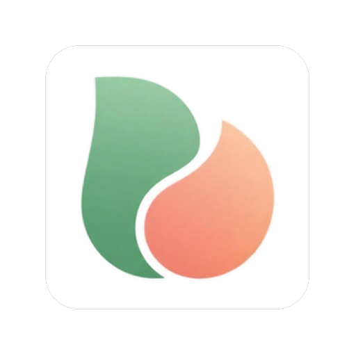

# PeachLeaf

<p align="center">
  
</p>

<p align="center">
  macOS를 위한 아름답고 가벼운 마크다운 스티커 노트 애플리케이션.
</p>

<p align="center">
  
  
</p>

## 소개

PeachLeaf는 스티커 노트의 단순함과 마크다운의 강력함을 결합한 네이티브 macOS 애플리케이션입니다. 여러 개의 플로팅 노트 윈도우를 만들고, 외관을 커스터마이즈하며, 마크다운 포맷과 인라인 이미지로 생각을 정리하세요.

## 기능

### 📝 마크다운 편집
- 실시간 미리보기가 있는 완전한 마크다운 문법 지원
- CodeMirror 6를 사용한 문법 강조
- 편집 모드와 미리보기 모드 간 전환
- 500ms 디바운스 자동 저장

### 🖼️ 이미지 지원
- 클립보드에서 이미지 직접 붙여넣기 (⌘V)
- 노트에 이미지 드래그 앤 드롭
- 편집 중 인라인 이미지 미리보기
- 8방향 핸들로 이미지 크기 조정
- 크기 조정 시 종횡비 유지
- 노트와 함께 로컬에 저장되는 이미지

### 🎨 커스터마이징
- 사전 정의된 색상 팔레트에서 선택
- 배경색과 텍스트 색상 개별 설정
- 노트별 영구적인 색상 설정
- 글꼴 크기 조정 (5단계)

### 🪟 윈도우 관리
- 여러 개의 독립적인 노트 윈도우 생성
- 화면 어디든 윈도우 드래그
- 원하는 대로 노트 크기 조정
- 위치 영속성이 있는 멀티 모니터 지원
- 앱 실행 시 윈도우 자동 복원

### ⌨️ 키보드 단축키
- `⌘N` - 새 노트 생성
- `⌘W` - 현재 노트 닫기
- `⌘M` - 편집/미리보기 모드 토글
- `⌘V` - 클립보드에서 이미지 붙여넣기
- `⌘Z` / `⌘⇧Z` - 실행 취소 / 다시 실행
- `Delete` / `Backspace` - 선택한 이미지 삭제

## 설치

### macOS 보안 안내

PeachLeaf를 처음 다운로드하고 열 때, macOS에서 보안 경고를 표시할 수 있습니다. 이는 Mac App Store 외부에서 배포되는 앱에서 나타나는 정상적인 현상입니다.

**"손상되었습니다" 또는 "파일이 손상되어" 오류가 나타나는 경우:**

DMG 파일 자체에 격리 속성이 있을 수 있습니다. 다음 명령어로 제거하세요:
```bash
# DMG에서 격리 속성 제거
xattr -cr ~/Downloads/PeachLeaf_1.0.1_aarch64.dmg

# DMG를 마운트하고 앱을 응용 프로그램으로 복사한 후:
xattr -cr /Applications/PeachLeaf.app
```

**"신뢰할 수 없는 개발자" 경고가 나타나는 경우:**

**방법 1: 우클릭으로 열기 (권장)**
1. PeachLeaf.app을 우클릭 (또는 Control-클릭)
2. 메뉴에서 "열기" 선택
3. 나타나는 대화상자에서 "열기" 클릭

**방법 2: 시스템 설정**
1. PeachLeaf를 정상적으로 열어봅니다 (차단됨)
2. 시스템 설정 → 개인 정보 보호 및 보안으로 이동
3. 아래로 스크롤하여 "PeachLeaf가 차단되었습니다" 찾기
4. "확인 없이 열기" 클릭

**방법 3: 터미널 명령어**
```bash
xattr -cr /Applications/PeachLeaf.app
```

이 방법 중 하나를 한 번 사용하면, 이후부터는 PeachLeaf가 정상적으로 열립니다.

## 사용법

### 노트 생성하기

1. **첫 실행**: 기본 노트 윈도우가 나타납니다
2. **새 노트**: `⌘N`을 누르거나 메뉴에서 `File → New Note`를 선택합니다
3. **입력 시작**: 노트의 아무 곳이나 클릭하여 편집을 시작합니다

### 이미지 작업하기

#### 이미지 추가하기
- **붙여넣기**: 이미지를 복사하고 에디터에서 `⌘V`를 누릅니다
- **드래그 앤 드롭**: 이미지 파일을 노트에 직접 드래그합니다

#### 이미지 크기 조정하기
1. 이미지를 클릭하여 선택합니다
2. 8개의 크기 조정 핸들(모서리 또는 가장자리) 중 하나를 드래그합니다
3. 이미지는 종횡비를 유지합니다

#### 이미지 삭제하기
- 이미지를 클릭하여 선택합니다
- `Delete` 또는 `Backspace`를 누릅니다

### 색상 커스터마이징

1. 메뉴에서 `Color → Choose Color...`를 선택합니다
2. 색상 팔레트를 클릭합니다
3. 색상 선택기가 자동으로 닫힙니다

### 모드 전환하기

- **편집 모드**: 문법 강조가 있는 완전한 마크다운 편집
- **미리보기 모드**: 렌더링된 마크다운 보기
- 토글: `⌘M`을 누르거나 툴바의 모드 버튼을 클릭합니다

### 글꼴 크기

메뉴에서 `Font`를 선택하고 다음 중 하나를 선택합니다:
- Default (16px)
- Small (14px)
- Medium (18px)
- Large (20px)
- Extra Large (24px)

## 파일 저장소

모든 데이터는 홈 디렉토리에 로컬로 저장됩니다:

```
~/.peach-leaf/
├── state.json                    # 윈도우 위치 및 설정
└── notes/
    ├── note-1234567890.md        # 노트 내용
    └── images/
        └── note-1234567890/      # 이 노트의 이미지
            ├── image-1234567891.png
            └── image-1234567892.png
```

### 마크다운 형식

노트는 이미지에 대한 선택적 너비 주석과 함께 일반 마크다운 파일로 저장됩니다:

```markdown
# 내 노트

여기에 텍스트가 있습니다.

<!-- width:600 -->

더 많은 텍스트.
```

## 문제 해결

### 실행 시 노트가 복원되지 않음
- `~/.peach-leaf/state.json`이 존재하는지 확인합니다
- 파일 권한을 확인합니다
- 앱을 재시작해 봅니다

### 이미지가 표시되지 않음
- 이미지가 `~/.peach-leaf/notes/images/`에 있는지 확인합니다
- 마크다운 문법을 확인합니다: ``
- 디스크에 이미지 파일이 존재하는지 확인합니다

### 앱이 실행되지 않음
- macOS 버전을 확인합니다 (macOS 10.15+ 필요)
- 앱이 격리 상태가 아닌지 확인합니다: `xattr -d com.apple.quarantine /path/to/PeachLeaf.app`

## 기술 스택

- **프론트엔드**: Svelte 5, TypeScript, Vite
- **에디터**: CodeMirror 6
- **백엔드**: Tauri 2.9, Rust
- **마크다운**: Marked 11.x
- **스타일링**: Svelte 스코프 스타일과 함께 CSS

## 기여하기

기여를 환영합니다! Pull Request를 자유롭게 제출해 주세요.

1. [저장소](https://github.com/hada0127/peach-leaf) 포크
2. 기능 브랜치 생성 (`git checkout -b feature/amazing-feature`)
3. 변경사항 커밋 (`git commit -m 'Add some amazing feature'`)
4. 브랜치에 푸시 (`git push origin feature/amazing-feature`)
5. Pull Request 열기

## 라이선스

이 프로젝트는 MIT 라이선스에 따라 라이선스가 부여됩니다 - 자세한 내용은 [LICENSE](LICENSE) 파일을 참조하세요.

## 감사의 말

- [Tauri](https://tauri.app/)로 구축되었습니다
- [CodeMirror](https://codemirror.net/)로 구동되는 마크다운 편집
- [Marked](https://marked.js.org/)를 사용한 마크다운 렌더링

## 지원

문제가 발생하거나 질문이 있으시면 [이슈를 열어주세요](https://github.com/hada0127/peach-leaf/issues).

---

macOS를 위해 ❤️로 만들어졌습니다
